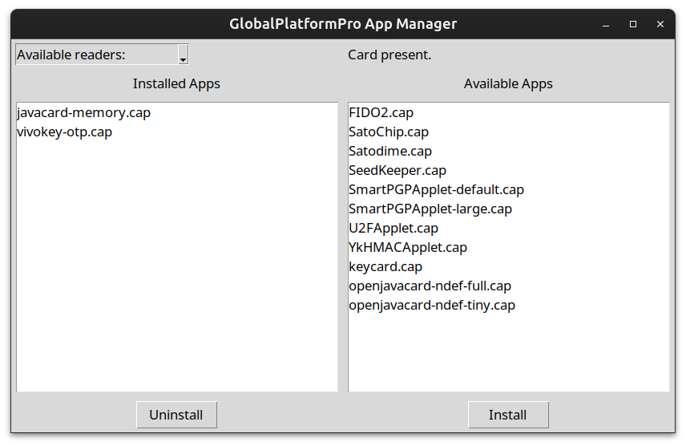

> [!INFO]
> LEGACY! See [this repo](https://github.com/dangerous-tac0s/global_platform_gui_qt) for the current version made with PyQT.

# Global Platform GUI
A quick attempt at GUI wrapper for [Global Platform Pro](https://github.com/martinpaljak/GlobalPlatformPro) by 
[Martin Paljak](https://github.com/martinpaljak) geared towards the [flexSecure](https://dngr.us/flexsecure).
Tons of credit go to [@Stargate01](https://github.com/stargate01), [@GrimEcho](https://forum.dangerousthings.com/u/grimecho/summary), and [@pilgrimsmaster](https://forum.dangerousthings.com/u/pilgrimsmaster/summary).

Looking for more information? Checkout the [flexSecure repo docs](https://github.com/DangerousThings/flexsecure-applets/tree/master/docs).

> [!CAUTION]
> DO NOT USE ON APEX DEVICES OR THOSE OTHERWISE CONFIGURED WITH NON-DEFAULT PASSWORDS--THE DEVICE WILL BE BRICKED!

Very early. Needs some cleanup.

Features:
- Decodes AIDs to names of flexSecure apps
- Installs the latest version of an app
- Can uninstall apps
- Will probably break at random
- Supports basic NDEF installation (selectable container size: 1-32kB)

Want a feature? Feel free to submit a PR.



## Known Issues
- Reader selection doesn't work
- U2F will be parsed as FIDO2 under installed apps

## Quick Start

- Don't have Python? Get it.
- Download and extract or clone the repo
- Install the required packages

```bash
pip install "requirements.txt" 
```

## Run

```bash
python main.py
```

## Detailed Getting Started Guide (For Windows) by [@pilgrimsmaster](https://forum.dangerousthings.com/u/pilgrimsmaster/summary)
This guide was made after a whopping two hours invested. Many improvements have been made. The current UI can be seen above.

### Ensure you have Python on your machine. 

You can grab Python from the Microsoft store.
Just search for "Python" and add the latest version


### Step 1 Download


Direct it to where you want to save it
Here is mine
\Working\DT\global_platform_gui-master

### Step 2 Extract
This bit looks simple (and it is) but it is also important
You need to know the path in order to run the Global platform


 So my path will be 

\Working\DT\global_platform_gui-master (copy yours to your clipboard now)


### Step 3 Open Command Prompt (many ways to do this, here is one)

Type cmd into search


### Step 4 Change Directory
Change your path to the extraction location, (type `cd` then a space followed by paste from your clipboard)
eg
 `cd \Working\DT\global_platform_gui-master`


You are now in that directory


### Step 5 Running Global Platform

 first we need to install the requirements
```bash
pip install -r "requirements.txt"
```


Wait ~10 secs
 you should see a bunch of successful script and the prompt waiting for the next command


** First Plug your reader in <s>NOW</s> if you haven’t already(No reader you will get an error<s>, you will have to close the program and run it again</s>)** 

Run the program
```bash
python main.py
```


You will see the attached reader (ACR122U in my case)


You will also see the installed apps on the left [This is my j3r180 test card](https://dangerousthings.com/product/j3r180-test-card/)

Then the same card after I installed an applet


I'm sure @tac0s will admit this is still a work in progress
eg, 
* currently there are some applets that won't install...yet
* <s>you won't see success or failure notifications unless you are looking at the cmd prompt window</s>
* <s>you'll have to re-run the program to refresh it to see the changes on the Global Program</s>
etc.

But as things are fixed/ added/ changed etc. 
a simple `git pull` should update

As mentioned this is a work in progress, HOWEVER in my opinion, This is far easier than the current method and opens up the FlexSecure to even more people.

Hopefully this guide will be easy to follow, just ask if you get stuck (ie. I may have fucked something up)
