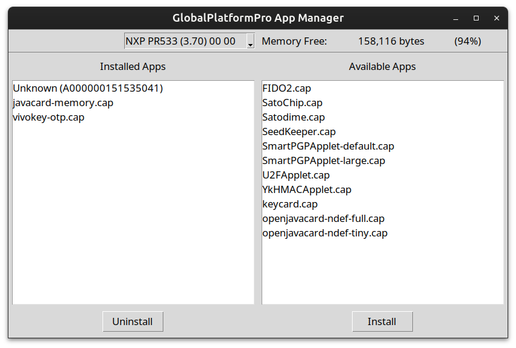

# Global Platform GUI
A quick attempt at GUI wrapper for Global Platform Pro geared towards flexSecure.

> [!CAUTION]
> DO NOT USE ON APEX DEVICES OR THOSE OTHERWISE CONFIGURED WITH NON-DEFAULT PASSWORDS--THE DEVICE WILL BE BRICKED!

Very early. Needs some cleanup.

Features:
- Decodes AIDs to names of flexSecure apps
- Installs the latest version of an app
- Can uninstall apps
- Will probably break at random

Want a feature? Feel free to submit a PR.



## Getting Started

- Don't have Python? Get it.
- Download and extract or clone the repo
- Install the required packages

```bash
pip install "requirements.txt" 
```

## Run

```bash
python main.py
```